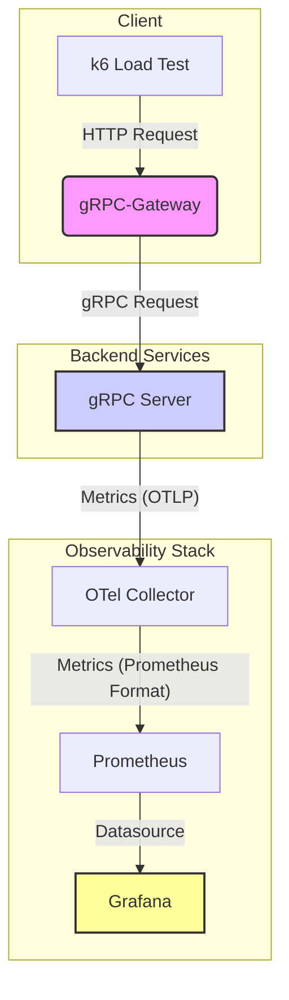

# gRPC Gateway + k6 + Observability 実装リポジトリ

このリポジトリは、gRPC-Gateway, k6, OpenTelemetry, Prometheus, Grafana を組み合わせたシステムの動作サンプルです。

元記事: [gRPC Gateway + REST で外部公開し、k6 を用いた並列ストリーム負荷試験で スループット × 可観測性](https://example.com) (※リンクはダミーです)

---

## ✨ 特徴

-   **gRPC & REST**: gRPC-Gateway を利用して、単一の gRPC サービス定義から gRPC と RESTful JSON API の両方を公開します。
-   **負荷テスト**: k6 を用いた高負荷シナリオで、システムのパフォーマンスを計測・検証します。
-   **可観測性**: OpenTelemetry によるメトリクス収集、Prometheus によるデータ集約、Grafana による可視化という、モダンな可観測性スタックを構築します。
-   **再現性**: Docker Compose により、すべてのコンポーネントをワンコマンドで起動できます。

---

## 🏗️ アーキテクチャ



---

## 📦 構成

```
.
├── proto/                  # Protocol Buffers 定義ファイル
├── server/                 # gRPC サーバ実装 (Go)
├── gateway/                # gRPC-Gateway 実装 (Go)
├── k6/                     # k6 負荷試験スクリプト
├── telemetry/              # OpenTelemetry, Prometheus, Grafana 設定
├── docker-compose.yml      # コンテナ構成一式
├── Makefile                # ビルドや実行のためのコマンド集
└── README.md               # このファイル
```

---

## ✅ 要件

### 前提

-   Docker / Docker Compose
-   Go (1.21 以上)
-   `protoc`, `protoc-gen-go`, `protoc-gen-grpc-gateway`

### ツールインストール

```bash
# protoc (macOS)
brew install protobuf

# Go 用プラグイン
go install google.golang.org/protobuf/cmd/protoc-gen-go@latest
go install google.golang.org/grpc/cmd/protoc-gen-go-grpc@latest

# gRPC-Gateway
go install github.com/grpc-ecosystem/grpc-gateway/v2/protoc-gen-grpc-gateway@latest
```

---

## 🚀 起動手順

1.  **Google API Proto ファイルの準備**
    gRPC-Gateway が利用する Google の標準 Proto ファイルをダウンロードします。
    ```bash
    make clone-googleapis-initial
    ```

2.  **Protobuf から Go コードを生成**
    `.proto` ファイルから gRPC および gRPC-Gateway の Go コードを生成します。
    ```bash
    make proto
    ```

3.  **アプリケーションのビルド**
    gRPC サーバと Gateway をビルドします。
    ```bash
    make build
    ```

4.  **全サービスの起動**
    Docker Compose を使って、アプリケーションと可観測性スタックをすべて起動します。
    ```bash
    make up
    ```

    **エンドポイント:**
    -   gRPC サーバ: `localhost:50051`
    -   gRPC-Gateway (REST API): `localhost:8080`
    -   Prometheus: `localhost:9090`
    -   Grafana: `localhost:3000`（ログイン: `admin` / `admin`）

---

## 🔬 負荷試験

k6 を使って REST API に負荷をかけます。

```bash
cd k6
k6 run load_test.js
```
*このテストは、100 VUs (仮想ユーザー) で 30 秒間、POST リクエストを送信し続けます。*

---

## 🛠️ Makefile コマンド一覧

| コマンド                      | 説明                                                               |
| --------------------------- | ------------------------------------------------------------------ |
| `make proto`                | `proto/` ディレクトリの `.proto` ファイルから Go コードを生成します。      |
| `make build`                | Go アプリケーションをビルドし、`app` というバイナリを生成します。        |
| `make up`                   | `docker-compose up` を実行し、すべてのサービスを起動します。           |
| `make down`                 | `docker-compose down` を実行し、すべてのサービスを停止します。           |
| `make clone-googleapis-initial` | `vendor/` に `googleapis` リポジトリをクローンします (初回のみ)。 |
| `make update-googleapis`    | `googleapis` リポジトリを最新の状態に更新します。                  |

---

## 📝 ライセンス

MIT